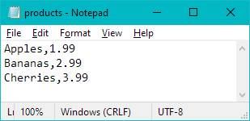
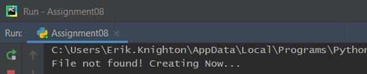
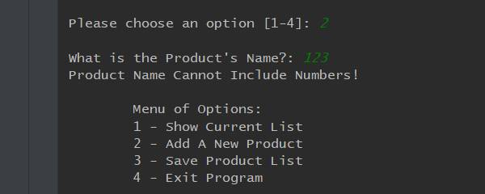
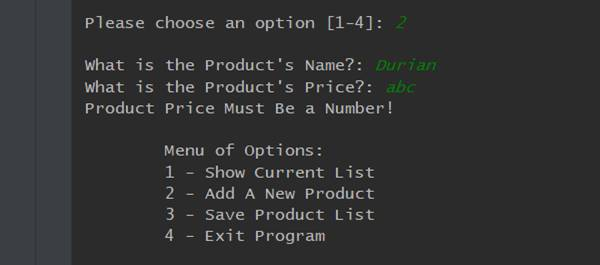
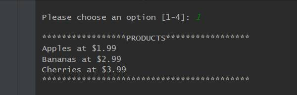
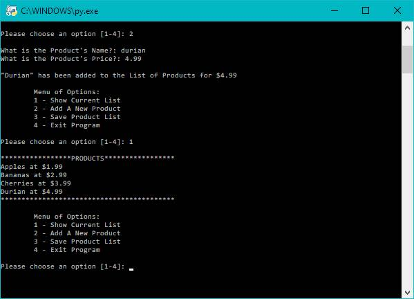
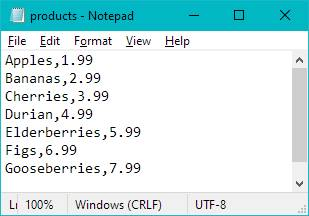
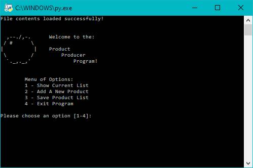

Erik Knighton -- 6/5/2020 -- IT FDN 100 A -- Assignment08
https://erikjkuw.github.io/IntroToProg-Python-Mod08/

# Objectively Classy

## Introduction

For this week's module I was better able to manage my time going in. Not only did this freedom allow me to focus on the preparatory work, but I did not have to scramble to fix all of the mistakes of researching concepts to fit the program idea I created. I still think that by overdoing it last week I gained some valuable experience in crafting my own script from scratch to look like the professional starters we had been given. With this week's module introducing new concepts of OOP (object-oriented programming), my saving grace was that I could ignore all of the extraneous parts of the program that we were better versed in, and work through the new object classification and their instances in the code.


Reflecting on the Self
The first things I did was go through all of the module links on Canvas, double checking that I watched both the module video and the starter video. The latter proved to be the cornerstone for last week's assignment, and so I did not want to miss any insight this time around.


I read the chapter in the textbook and mostly found it clear. In particular I found it interesting that the necessary self parameter is such a contested choice. From my time studying other languages, having objects self-reference was natural. Here's an example of the reflexive prefix from Ancient Greek that we have adopted into modern English (as happens when a Lingua-Franca persists): auto. We have auto-mobiles (things which move under their own power), auto-mation (that things work on their own), auto-cracy (governance by the governed), auto-graph (writing your own name), auto-biography (writing your own life story), etc. upon which we can iterate. 


Likewise in Spanish there are reflexive verbs, ending in -se, and reflexive pronouns. Comically, this creates confusion when a non-native speaker first encounters a phrase like "¿Cómo te llamas?" literally "What do you call yourself?" Without unpacking that convoluted translational meaning, a student may flounder due to English largely eliminating its reflexive requirements in favor of semantic contextualization. 


    *When we do use reflexive pronouns, we append the "self" suffix to our direct-object pronouns.* 


Now, I am highlighting this sentence, and I chose to write it that way because I have found Python to be very natural in the way it is set up, how it reads, and therefore how it can be written to perform tasks. In Python we modify the object class using self-referential parameter self so that the program knows it is working reflexively within its designated class. In English the speaker modifies  the object (the syntactic direct-object in this case) requiring a reference so that the listener understands the autonomy of the subject in the predicate. As I said, we don't often rely on reflexive pronouns in favor of context clues, but it does crop up especially when emphasis is needed. "I can do it." becomes "I can do it myself!" as children acquire their own sense of autonomy. 


Introspection and self-expression stem from these cognitive developmental milestones, and I have a sense that the creators of Python's intentional use of self as a parameter for object classes stems from the idea of independence in situ. And, because I thrive on this brand of serendipity, I plan to research the history of the development of the language is something in the near future.
 

## Producing Objects
On to the program itself! Scripting the Product class proved to be straightforward. I took liberally from the lab programs in the module to flesh out the constructor and its attributes, and then crafted setter/getter pairs for each. I chose to work with private attributes because I wanted to get their exceptions to trigger in the IO code without having to write in a separate print statement and incorporate that into the input function. This decision proved a bit cumbersome down the line, but it operates accurately, and so I built the rest of the program under the classic assumption: "if it ain't broke." That part of my code became the following (on the next page):

```
# -- Constructor
def __init__(self, product_name, product_price):
    # -- Attributes
    self.__product_name = product_name
    self.__product_price = product_price

# -- Properties
@property
def product_name(self):
    return str(self.__product_name).title() # Display string with capitalization

@product_name.setter
def product_name(self, value):
    if str(value).isnumeric() == False: # Checks alphabet only name
        self.__product_name = value
    else:
        raise Exception("Product Name Cannot Include Numbers!")

@property
def product_price(self):
    return round(self.__product_price, 2) # Display float to 2 decimal places

@product_price.setter
def product_price(self, value):
    if value.isalpha() == False: # Checks number only price
        self.__product_price = float(value)
    else:
        raise Exception("Product Price Must Be a Number!")
```

The other immediate issue I had was in printing out the object. The textbook puts it succinctly, that "if I were to print an object... Python would come back with something like the cryptic: <__main__.Critter object at 0x00A0BA90>... However... you can create a string representation for your objects that will be displayed whenever one is printed." (p 228). This immediately clarified my problem. I was getting the cryptic memory address readout, obviously due to my lack of definition for stringing the object's attributes. I came up with the following:

```
def __str__(self):
    return self.product_name + "," + str(self.product_price)
```

I wrote my new string method with comma delineation so that when it was stored to the text file it would be easier to extract. Doing it here saved me having to write that part into the storage function later in the code, which I discovered after a few iterations. I could not find any reason why I should refrain from doing it in this order, so if it runs counter to Python's stylistic intent I will make amends. Regardless, the objects are stringified, and then saved as formatted into the document (Figure 1).



#### Figure 1. Objects by Line and Attributes Separated by Commas


The final thing I added to the object class was a method for adding the instanced object to the list after its attributes were modified in the IO function. I was not sure if it belonged in this class or in the IO function itself, but chose to keep the two operations unique to start so that I could test them individually. Once I had everything running without error, I left them as is. Again, if this adds unnecessary complexity to my code where I should be striving for simplification, I shall endeavor to learn from the mistake. 

 
## Filing Objects


Originally I had written the read and write FileProcessor functions as closely resembling the code from the previous few modules. After adjusting for errors in the read stage, I was able to account for both an empty and non-existent file, providing a solution for the latter and choosing to save the message for the former in the list print out IO function. My code looks like the following (on next page):

```
@staticmethod
list_of_product_objects.clear()
while True:
    try:
        with open(file_name, "r+") as file:
            for line in file:
                product_name, product_price = line.split(",")
                row = Product(product_name, float(product_price))
                list_of_product_objects.append(row)
    except EOFError: # End read loop if end of file error
        break
    except FileNotFoundError: # Create file if it doesn't exist
        print("File not found! Creating Now...")
        print()  # Add extra line for looks
        file = open(file_name, "a+")
        file.close()
        break
    finally: # End read loop if no errors found and file is blank
        print("File contents loaded successfully!\n")
        break
return list_of_product_objects
```

When the file is not located, or misnamed, the function creates a new object file with the "a+" access mode. I added a print statement here to verify that the file was created when the FileNotFoundError exception is raised. This statement appears when first opening the program, above the initial greeting (Figure 2).


 
#### Figure 2. PyCharm Screen Showing File Creation Message

Writing to the file was almost identical to previously writing dictionary rows in lists as lines. The following code shows the method:

```
@staticmethod
def save_data_to_file(file_name, list_of_product_objects):
    with open(file_name, "w+") as file:
        for product in list_of_product_objects:
            # Strings formatted with __str__ method in Product class
            file.write(str(product) + "\n")
    return list_of_product_objects
```

The output to the file was already shown in Figure 1 above. What may be noticeably absent here and in my other functions was the addition of status statements in the return lines. I made this decision largely to save time. I often get carried away and so did not wish to linger on the extraneous when the new concepts were so alien. Instead, there are print statements relegated to the Main Body script whenever a function successfully completes. A bit janky, perhaps, but it avoided miscellaneous methods from clogging up the IO class.

Moving on. 

 
## Filling Attributes


Writing the function that would capture inputs for both the name of the product and its associated price, proved to be the most difficult part of the script. The first obstacle I ran into was getting the errors to raise the exception messages from the attribute setter segments. I spent far too long spinning my wheels, as it were, searching Stack Overflow (largely unhelpful), and reading both the course textbook and my other introductory book. What ended up being wrong was that I wasn't initializing an object before requesting changes to the attributes. Because I was using them privately, my setters and getters weren't operating completely when the user input anything. 


I initialized an object directly in the IO method, and gave it empty attribute values which could then be manipulated by the subsequent code, and would raise exceptions as intended. I noticed in one of the labs, where there was a conditional statement for a name not to include numbers, that the body script began by doing the same. That is, objP1("Bob") was created, and then the name "robert" was given, run through the class, and printed back out as "Robert".
Here again, if this is unPythonic, to write the initialization of an object into a function of another class, I will find alternatives. For now it worked, and I was able to put the IO function into a try statement with an except clause showing both that the name cannot include numbers (Figure 3), nor could the price include anything but numbers (Figure 4). 


 
#### Figure 3. PyCharm Screen Showing Exception for Product Name


For the product object's price, having the exception be raised even when the input should be a float and not a string, required that I capture it plainly as a string, and then push the float value after running the isalpha() conditional check in the attribute setter, as was shown above. This was the only way I was able to get past a ValueError, and have the attribute value persist when it was numeric.


 
#### Figure 4. PyCharm Screen Showing Exception for Product Price


After adding a few new product objects, or when the file loads into the list, the user has the option of viewing their list. I formatted this a bit more legibly than how it is stored in the text file as a preference. I also excluded the delete option from the menu, though it would have matched previous instances of removing data from a list. When chosen, the list of products is displayed (Figure 5).


 
#### Figure 5. PyCharm Screen Showing List of Objects Displayed to User


From here I went back through my program, running it in debug mode and throwing various inputs at it to make sure other errors didn't raise their heads. Satisfied that it was operating without a hitch, I ran it in the Command Prompt (Figure 6).



#### Figure 6. Command Prompt Showing Item Added to List


This gave me the final text file inventory (Figure 7), which was alphabetically sorted intentionally as I added new product objects. Having worked with sort() for my lists in the last assignment, I would have liked to do so here again, but ultimately chose to constrain myself to the module topics.



#### Figure 7. Text File After Creating Multiple Objects and Saving List


The final cherry on top was actually an ASCII apple I found at https://www.asciiart.eu/food-and-drinks/apples (External Link), which greets the user like the dice did before. The textbook's use of ASCII in an early chapter stuck with me, and it adds a little bit of flavor or flare to the user experience (Figure 8).



#### Figure 8. Command Line Showing ASCII Greeting and Menu


## Summary 
Not knowing if my program is written correctly, but knowing that it works at every stage is a programmer hallmark. The joke that it becomes someone else's problem after that rings true here as well. Wrong or right, it runs, and the user is met with a clean interface and readable printouts. There is no sign of error at the frontend, but the backend is perhaps a messy web of unoptimization.

Because we are still learning, and it is still very early in my development as a programmer, I will own my shortcomings, be introspective, and use my code reflexively to do so. This module was difficult, as was outlined, but if I am to understand objects and object-oriented programming, I need to plug away at it. Familiarizing myself with private attributes, setters and getters, how object classes are organized, initializing each object, instances of objects, and how they tie into the greater script were all unique puzzles to put together, shaping the big picture of the concepts in this module. I can't see its shape yet, but I know that will come with time.

The analogy of learning a boardgame by listening to a brief explanation and then playing, only to discover that after that playthrough that you yourself have enough understanding of the rules to then teach the game to someone else rang very true to me. As an avid board gamer and linguist, I appreciate that this isn't a brute-force way of learning the concepts, but more a subtle way to grow iteratively by doing. 

*Something I learned in my cognitive linguistics courses is that every such instance coalesces to create categorical knowledge, branching to connect or compressing information selectively as novel experiences occur. The similarity to machine learning and natural language processing is what lead me to Python in the first place, and thus this class. It feels serendipitous, indeed.*

